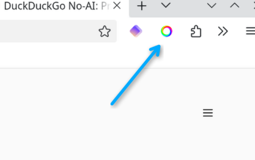
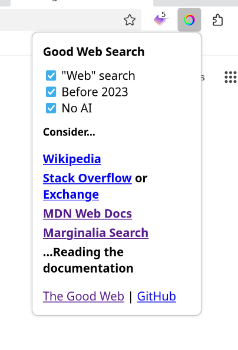

# Good Web Search

*Search the good web again.*

Good Web Search is an extension for Firefox and Chromium-based browsers that automatically adjusts search parameters to surface more useful results and makes search engines behave more like they used to in the "good ol' days" of the web by reducing AI-generated clutter and enabling hidden search options. 

## Details

### Web Search Mode

For Google searches, Good Web Search can enable "web" search mode, removing most of the clutter and distractions found in the default view.

### Before 2023

Appends `before:2023` to search queries, surfacing good results that recently are often flooded beneath an ocean of AI slop.

### No AI

Appends `-ai` to search queries, further holding back the dilugue. In the case of DuckDuckGo searches, it instead redirects to `noai.duckduckgo.com`.

### Search Engine Support

Good Web Search is currently (2026-06-22) tested and working with:

- Google (all features)
- [Ecosia](https://www.ecosia.org/) (before 2023, no ai)
- [DuckDuckGo](https://duckduckgo.com) (no ai)
- Brave (no ai)
- Bing (no ai)

## Usage

### Installation

1. Download [latest release](https://github.com/cobbland/good-web-search/releases/latest) from GitHub (`.zip` for Firefox or `.crx` for Chrome) or from [Add-ons for Firefox](https://addons.mozilla.org/en-US/firefox/addon/good-web-search/)
2. Open web browser and navigate to extension page
3. Enable “Developer mode” if required
4. Drag and drop extension file onto page
5. Review extension permissions and install/enable

### Updating

1. Download [latest release](https://github.com/cobbland/good-web-search/releases/latest) from GitHub (`.zip` for Firefox or `.crx` for Chrome)
2. Open web browser and navigate to extension page
3. Drag and drop extension file onto page

### Using

1. Click the Good Web Search icon
2. Toggle checkboxes to turn features off and on (disabled options are not available for current search engine)
3. Search the web as you normally would

## Development

### Firefox

- Install `web-ext`: `npm install --global web-ext`
- To run live for testing: `npm run start:firefox`
- To build: `npm run build:firefox`

### Chrome

- Use the Chrome browser's built in tools.

## Roadmap

- Refactor code (more closely following browser extension APIs)
- Fix support for [StartPage](https://www.startpage.com)

## Contribute

If you would like to contribute to this project, please fork and make a pull request. Also, if you have suggestions or find bugs, please feel free to open an issue.

## License

[GNU GENERAL PUBLIC LICENSE](LICENSE)

## Contact

[hello@jacobdensford.com](mailto:hello@jacobdensford.com)
